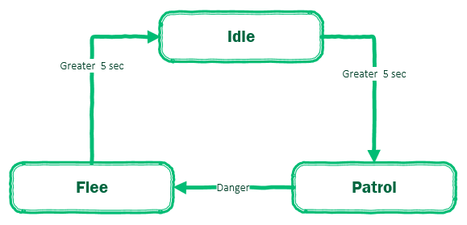
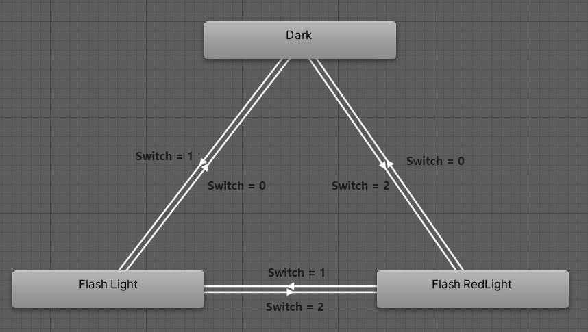
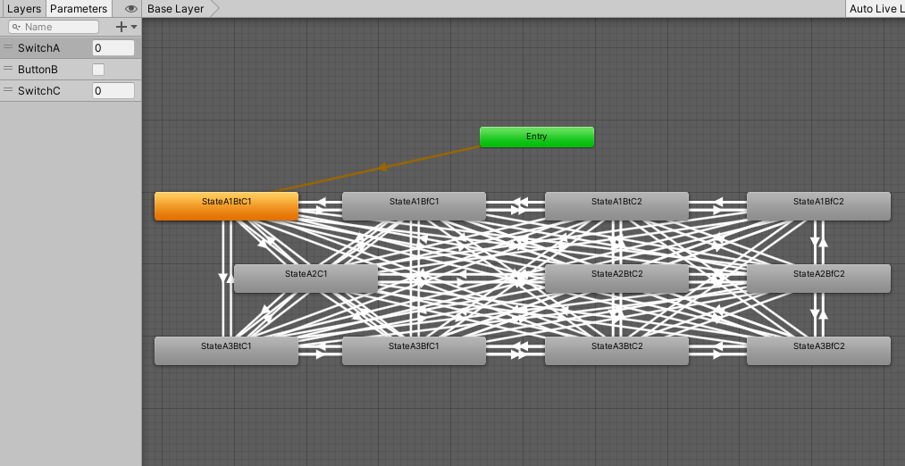
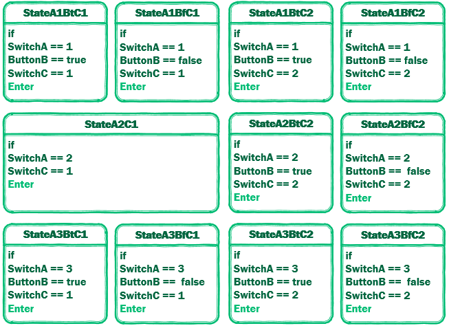

# StateMachine-Famework
适用于游戏或虚拟仿真(业务)的状态机框架。（还在完善中...）

## 特色

- 包含有限状态机和层次状态机的实现

- 可通过创建状态图及状态点，快速构建有限状态机
- 支持链式写法（Lambda）
- 状态可扩展，内置定时任务的状态、计时时间状态
- 等...

## 例子

### 简单状态机

#### 一、实现如下NPC角色的状态机。



NPC角色进入闲置状态5秒后，进入巡逻状态。在巡逻状态中受到伤害，进入逃跑状态。在逃跑5秒后，进入闲置状态。

代码实现:

```c#
        //构造状态机
        FSM npcFsm = new FSM();

        //创建时间块
        TimeChunk time5s = new TimeChunk(GetDeltatime, 5000);
		//状态机更新时间间隔单位为毫秒，GetDeltatime委托返回状态机距离上一次更新的时间差

        //创建状态
		//TimerFS为计时时间状态，通过Finished获取当前是否计时完毕
        TimerFS idle = new TimerFS("idle",time5s);
        TimerFS flee = new TimerFS("flee", time5s);
        FiniteState patrol = new FiniteState("patrol", PatrolonEnter, PatrolOnTick, PatrolonExit);

		//设置转换条件
		idle.To(patrol, idle.Finished).To(flee, GetDanger).To(idle,flee.Finished);//GetDanger为委托
        
        npcFsm.SetState(idle);//设置初始状态
```
每帧定时更新状态机。

```c#
      fsm.Tick();
```

*补充:*

TimerFS类为扩展的**计时时间状态**类。通过**计时时间状态**对象的Finished()可以使用判定是否计时完成。

#### 二、实现仿真部件红外灯的状态机



红外灯包含3个状态，灭、正常闪烁、红外闪烁。

```c#
     //构造状态机
     FSM lightflashfsm = new FSM();

     //创建时间块
     TimeChunk time = new TimeChunk(GetDeltatime, 1000);

     //创建状态s
     FiniteState light = new TimerTaskFS("light", time, () => { _lightflag = !_lightflag;}, () => { _lightflag = true; },
         () =>
         {
             if (_lightflag) SendSignal(LightType.NormalLight);
             else SendSignal(LightType.Dark);
         }, () => { _lightflag = true; });
     FiniteState redlight = new TimerTaskFS("redlight", time, () => { _lightflag = !_lightflag; }, () => { _lightflag = true; },
         () =>
         {
             if (_lightflag) SendSignal(LightType.RedLight);
             else SendSignal(LightType.Dark);
         }, () => { _lightflag = true; });
     FiniteState dark = new FiniteState("dark", onTick: () => SendSignal(LightType.Dark));

     //设置转换条件
     redlight.OrTo(dark, () => GetComDataSwitch(0)).OrTo(light, () => GetComDataSwitch(1));
     light.OrTo(redlight, () => GetComDataSwitch(2)).OrTo(dark, () => GetComDataSwitch(0));
     dark.OrTo(light, () => GetComDataSwitch(1)).OrTo(redlight, () => GetComDataSwitch(2));

     lightflashfsm.SetState(dark);
```

部分定义：

```c#
        private bool _lightflag;//灯光闪烁标志
        public  bool GetComDataSwitch(int val) => InputManager.Instance.Data.ComDataSwitch == val;//判断当前数据是否满足转换条件
```

每帧定时更新状态机。

```c#
      fsm.Tick();
```

*补充:*

TimerTaskFS类为扩展的**定时任务状态**类。**定时任务状态**会在状态运行期间，定时执行传入委托。


### 层次状态机

...

------

### 使用状态图构建有限状态机

##### 有限状态机的局限性：

1、状态机跳转条件一旦不满足，就会卡在某一个状态。（状态机会卡主）

2、复用性差，一旦状态机的需求发生改变。你需要会新状态重构有限状态机

3、大的状态机很难维护

4、设计状态机的结构很复杂，需要合理分割和逻辑跳转

##### 什么是状态图:

是一种类似有向完全图的数据结构，即包含n个状态点和n(n-1)个弧的有向图。可参考Unity的Animator面板的状态机图。状态点内包含状态和此状态的输入参数的键值。



##### 使用状态图构建有限状态机：

1、因为所有情况都考虑了，定义跳转条件正确的话，不会存在卡主的情况。

2、复用性提高，需求发生改变时，只需要修改对应模块。

3、构建大型有限状态机代码量更少，方便维护。

4、由于所有状态的转变情况都考虑了，性能开销变大。

#### 实现一个仿真部件的状态机：

#### 实现一个仿真产品部件的状态机

仿真部件的状态由三个输入参数控制，开关SwitchA（值:1,2,3）、按钮ButtonB（值:true,fasle）、SwitchC（值:1,2）。构成状态以及状态条件：



如：当SwitchA == 1且ButtonB == true且SwitchC==1时进入StateA1BtC1状态...

所有状态根据输入参数是否满足转换条件可以进行自由转换。

用Unity的Animator画一下状态机各状态的联系：


代码实现:

```c#
            //构造状态机
            FSM LightFSM = new FSM();

            //创建状态
            FiniteState StateA1BtC1 = new FiniteState("StateA1BtC1", SendSignal);//状态每帧调用SendSignal委托向硬件反馈响应数据
            FiniteState StateA1BfC1 = new FiniteState("StateA1BfC1", SendSignal);
            FiniteState StateA1BtC2 = new FiniteState("StateA1BtC2", SendSignal);
            FiniteState StateA1BfC2 = new FiniteState("StateA1BfC2", SendSignal);
            FiniteState StateA2C1 = new FiniteState("StateA2C1", SendSignal);
            FiniteState StateA2BtC2 = new FiniteState("StateA2BtC2", SendSignal);
            FiniteState StateA2BfC2 = new FiniteState("StateA2BfC2", SendSignal);
            FiniteState StateA3BtC1 = new FiniteState("StateA3BtC1", SendSignal);
            FiniteState StateA3BfC1 = new FiniteState("StateA3BfC1", SendSignal);
            FiniteState StateA3BtC2 = new FiniteState("StateA3BtC2", SendSignal);
            FiniteState StateA3BfC2 = new FiniteState("StateA3BfC2", SendSignal);

            //输入参数标签TagPair.key：输入参数类型的唯一标识，TagPair.value：输入参数类型的值
            //Tag_SwitchA
            TagPair SwitchA_1 = new TagPair(1, 1);
            TagPair SwitchA_2 = new TagPair(1, 2);
            TagPair SwitchA_3 = new TagPair(1, 3);
            //Tag_ButtonB
            TagPair ButtonB_T = new TagPair(2, 1);
            TagPair ButtonB_F = new TagPair(2, 2);
            //Tag_SwitchC
            TagPair SwitchC_1 = new TagPair(3, 1);
            TagPair SwitchC_2 = new TagPair(3, 2);

            //创建输入参数查询字典 输入参数标签--以及当输入条件满足委托
            Dictionary<TagPair, Func<bool>> cond = new Dictionary<TagPair, Func<bool>>();
            cond.Add(SwitchA_1, () => GetSwitchA(1));
            cond.Add(SwitchA_2, () => GetSwitchA(2));
            cond.Add(SwitchA_3, () => GetSwitchA(3));
            cond.Add(ButtonB_T, () => GetButtonB(true));
            cond.Add(ButtonB_F, () => GetButtonB(false));
            cond.Add(SwitchC_1, () => GetSwitchC(1));
            cond.Add(SwitchC_2, () => GetSwitchC(2));

            //将输入参数满足条件字典传入构造函数，构建状态图
            StateMap stateMap = new StateMap(cond);

            //生成状态点列表，为每个状态点绑定标签，此时便可知进入状态的所需要满足标签
            StatePoint StateA1BtC1_Point = new StatePoint(StateA1BtC1, SwitchA_1, ButtonB_T, SwitchC_1);
            StatePoint StateA1BfC1_Point = new StatePoint(StateA1BfC1, SwitchA_1, ButtonB_F, SwitchC_1);
            StatePoint StateA1BtC2_Point = new StatePoint(StateA1BtC2, SwitchA_1, ButtonB_T, SwitchC_2);
            StatePoint StateA1BfC2_Point = new StatePoint(StateA1BfC2, SwitchA_1, ButtonB_F, SwitchC_2);
            StatePoint StateA2C1_Point = new StatePoint(StateA2C1, SwitchA_2, SwitchC_1);
            StatePoint StateA2BtC2_Point = new StatePoint(StateA2BtC2, SwitchA_2, ButtonB_T, SwitchC_2);
            StatePoint StateA2BfC2_Point = new StatePoint(StateA2BfC2,SwitchA_2, ButtonB_F, SwitchC_2);
            StatePoint StateA3BtC1_Point = new StatePoint(StateA3BtC1,SwitchA_3, ButtonB_T, SwitchC_1);
            StatePoint StateA3BfC1_Point = new StatePoint(StateA3BfC1, SwitchA_3, ButtonB_F, SwitchC_1);
            StatePoint StateA3BtC2_Point = new StatePoint(StateA3BtC2, SwitchA_3, ButtonB_T, SwitchC_2);
            StatePoint StateA3BfC2_Point = new StatePoint(StateA3BfC2, SwitchA_3, ButtonB_F, SwitchC_2);

            //状态图添加状态点
            stateMap.AddStatePoint(StateA1BtC1_Point, StateA1BfC1_Point, StateA1BtC2_Point, StateA1BfC2_Point, StateA2C1_Point, StateA2BtC2_Point, StateA2BfC2_Point, StateA3BtC1_Point, StateA3BfC1_Point, StateA3BtC2_Point, StateA3BfC2_Point);

            if (stateMap.CreateStateMap()) stateMap.CreateStateFSM();//如果构建状态图成功，则为每个状态创建转换条件联系，构建状态机结构

            LightFSM.SetState(StateA1BtC1);//设置初始状态
```

输入条件满足方法的实现：

```c#
        	//InputManager.Instance.Data.SwitchA接受硬件输入值（可能来自串口数据、网络UDP数据包等）
			public static bool GetSwitchA(int val) => InputManager.Instance.Data.SwitchA == val;
```

每帧定时更新状态机。

```c#
      fsm.Tick();
```


未完待续...

More documentation coming soon...